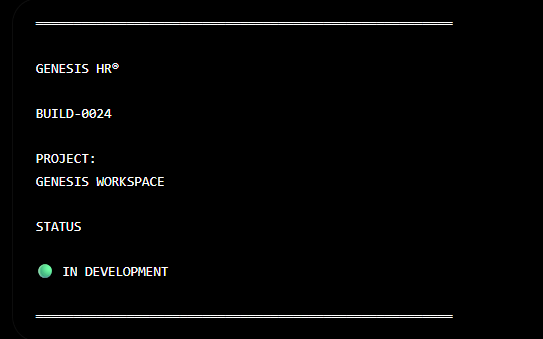

КАТАЛОГ ПО СОСТОЯНИЮ НА 21\06\26

GENESIS v1 Architecture (LOCKED)
GEN-OS/
│
├── kernel/
├── ui/
├── importer/
├── ai/
│
└── genesis_knowledge/
    │
    ├── entities/
    ├── registry/
    ├── providers/
    ├── pipeline/
    ├── storage/
    │
    └── domains/
        │
        ├── career/
        ├── development/
        ├── psychology/
        ├── education/
        ├── health/
        ├── finance/
        ├── relationships/
        ├── family/
        ├── business/
        └── lifestyle/

Больше структуру не меняем.

GEN-OS/
└── genesis_knowledge/
    │
    ├── entities/
    │
    ├── relations/
    │   │
    │   ├── profession_competency/
    │   ├── competency_habit/
    │   ├── competency_book/
    │   ├── competency_course/
    │   ├── competency_sport/
    │   ├── competency_hobby/
    │   ├── competency_behavior/
    │   ├── competency_environment/
    │   ├── profession_environment/
    │   ├── profession_tool/
    │   ├── profession_salary/
    │   ├── profession_future/
    │   └── ...
    │
    ├── professions/
    ├── competencies/
    ├── habits/
    ├── books/
    ├── sports/
    ├── hobbies/
    ├── environments/
    ├── behaviors/
    ├── protocols/
    ├── courses/
    ├── providers/
    ├── pipeline/
    ├── registry/
    └── storage/

Поэтому я предлагаю окончательный список модулей GEN-OS
◎ Digital Twin

◈ Career Intelligence

⬒ Knowledge Import

⬢ Knowledge Explorer

◉ Future Simulator

✦ AI Advisor

⬡ Knowledge Graph

⚙ Platform

GENESIS MANIFEST v0.1

АРХИЕКТУРНЫЕ ПРИНЦИПЫ СИСТЕМЫ GENOS

💡 Knowledge First — знания важнее интерфейса.
💡 Single Responsibility — один класс = одна задача.
💡 Storage Agnostic — ядро не знает, где хранятся данные.
💡 Provider Agnostic — ядро не знает, откуда пришли данные.
💡 Graph Native — любая сущность должна быть пригодна для включения в граф.
💡 Human Readable — Registry хранится в читаемом формате.
💡 Versioned Everything — у каждого файла, схемы и сущности есть версия.

GENESIS HR®
Engineering Manifest
We are not building another HR platform.
We are building a Human Intelligence Operating System.
==================================================================================================
MISSION
Genesis помогает человеку понять себя.
Не по одному тесту.
Не по астрологии.
Не по одной профессии.
А через цифровую модель личности.
==================================================================================================
VISION

Каждый человек имеет Digital Twin.
Twin постоянно развивается.
Twin способен моделировать будущее.
Twin помогает принимать решения.
==================================================================================================
CORE IDEA

Мы не строим HR CRM.
Мы не строим ATS.
Мы строим
Human Intelligence Platform.
==================================================================================================
PRINCIPLE 001
Human First
Сначала человек.
Потом профессия.
Не наоборот.
==================================================================================================
PRINCIPLE 002
Digital Twin
Все данные проекта вращаются вокруг цифрового двойника человека.
Не профессии.
Не компетенции.
Не рынка.
Именно человека.
==================================================================================================
PRINCIPLE 003
Knowledge Graph
Вся информация является графом знаний.
Никаких разрозненных таблиц.
Все связано.
==================================================================================================
PRINCIPLE 004
No Fake Mathematics
Никаких придуманных коэффициентов.
Если модель делает вывод —
она должна объяснить почему.
==================================================================================================
PRINCIPLE 005
Evidence Based
Каждый вывод обязан иметь источник.
Источник может быть:
• эксперт
• научная публикация
• ESCO
• O*NET
• статистика
• AI reasoning
==================================================================================================
PRINCIPLE 006
Confidence
Каждый вывод имеет уровень доверия.
Не существует абсолютной истины.
=================================================================================================
PRINCIPLE 007
Explainability
Любой вывод должен объясняться.
Почему человеку рекомендована профессия?
Почему книга?
Почему навык?
Почему курс?
Почему спорт?
Ответ должен существовать всегда.
==================================================================================================
PRINCIPLE 008
Everything is an Entity
Любой объект платформы —
Entity.
Профессия.
Книга.
Навык.
Привычка.
Компетенция.
Университет.
Спорт.
Среда.
Хобби.
Все одинаковые сущности.
Отличается только тип.
==================================================================================================
PRINCIPLE 009
Relations Are More Valuable Than Data
Ценность не в количестве данных.
Ценность в связях.
==================================================================================================
PRINCIPLE 010
Import Once — Use Forever
Любые знания импортируются один раз.
После нормализации используются всеми движками платформы.
==================================================================================================
PRINCIPLE 011
AI Does Not Own Knowledge
AI ничего не хранит.
AI рассуждает.
Знания принадлежат Registry.
==================================================================================================
PRINCIPLE 012
Registry Is Truth
Единственный источник истины —
Registry.
Все остальные сервисы —
потребители.
==================================================================================================
PRINCIPLE 013
Import Before Intelligence
Сначала знания.
Потом аналитика.
==================================================================================================
PRINCIPLE 014
Workspace Before Features
Любая новая возможность появляется внутри Workspace.
Не наоборот.
==================================================================================================
PRINCIPLE 015
Beautiful Engineering
Инженерная система должна быть красивой.
Не только работать.
Но и вызывать желание открыть её снова.
==================================================================================================
PRINCIPLE 016
No Technical Debt by Design
Лучше написать на день позже.
Чем потом год поддерживать плохое решение.
==================================================================================================
PRINCIPLE 017
Modules Instead of Chaos
Любая новая возможность —
отдельный модуль.
Никаких "огромных" файлов.
==================================================================================================
PRINCIPLE 018
Import Engine Is Universal
Импорт не знает,что такое профессия.
Он знает только Pipeline.

Source
↓
Parser
↓
Validator
↓
Normalizer
↓
Preview
↓
Registry
↓
Storage
==================================================================================================
PRINCIPLE 019
Knowledge Is Eternal

Любые знания должны жить независимо от UI.
GUI можно переписать.
Registry нельзя потерять.
==================================================================================================
PRINCIPLE 020

Genesis Is a Platform
Мы строим не приложение.
Мы строим платформу.
==================================================================================================
ENGINEERING STANDARDS

Каждый новый модуль содержит:
README.md
__init__.py
api.py
engine.py
registry.py
models.py
tests.py

если это необходимо.
Каждый файл имеет фирменный Header. Каждый публичный метод имеет описание. 
Код разбивается на маленькие классы. Максимум ответственности на класс.
==================================================================================================
UI STANDARDS (GDL)

Genesis Design Language
Dark Surface
Gold Accent
Large Radius
Soft Shadow
Minimal Noise
Maximum Readability
Workspace First
Cards
Panels
Dock Layout
Professional Typography
No Bootstrap Feeling
==================================================================================================
DATA PIPELINE
Provider
↓
Importer
↓
Parser
↓
Validator
↓
Normalizer
↓
Translator
↓
Entity Registry
↓
Knowledge Graph
↓
Digital Twin
↓
AI
↓
Recommendations
==================================================================================================
PRODUCT ROADMAP

Workspace
↓
Knowledge Acquisition
↓
Registry
↓
Knowledge Graph
↓
Digital Twin
↓
Career Engine
↓
Development Engine
↓
Prediction Engine
↓
AI Mentor
↓
Simulation
==================================================================================================
LONG TERM GOAL

Genesis становится операционной системой развития человека.
Не тестом.
Не HR.
Не психологией.
А полноценной интеллектуальной платформой.

22.06.2026

=====================================================
КРАТКИЙ СЦЕНАРИЙ ПО СПРИНТАМ по состоянию на 22.06.26
=====================================================
**СПРИНТ 1**
Workspace MVP
Цель
Чтобы человек открыл программу
и сказал
Вау.
Не из-за анализа.
Из-за ощущения продукта.
Мы делаем
Workspace
полностью.

В него входит:
**Sidebar
**Toolbar
**StatusBar
**Dashboard
**Explorer
**Inspector
**Console
**Cards
**Widgets

Все это уже есть.
Нужно довести.

**СПРИНТ 2**
Knowledge
То есть
Entity Registry
Relation Registry
Graph
Поиск
Фильтрация

**СПРИНТ 3**
Import Station
Вот здесь уже
ESCO
ONET
CSV
Excel
JSON

**СПРИНТ 4**
Human Workspace
Вот это будет бомба.
        Человек
      Компетенции
Карьера
Навыки
Слабые стороны
Потенциал
Прогноз
AI
Профессии
Доход
Рекомендации
Это будет главный экран продукта.

****
SimulationСПРИНТ 5
То, что ты давно хотел.
Например
Добавить навык Python
↓
что изменится
↓
через 2 года
↓
зарплата
↓
карьера
↓
вероятность успеха
Или
Убрать английский
↓
последствия
Или
Переехать в Канаду
↓
что изменится

**СПРИНТ 6**
AI
Советы
Отчеты
Аналитика
LLM

**СПРИНТ 7**
Личный кабинет
Подписки
Оплата